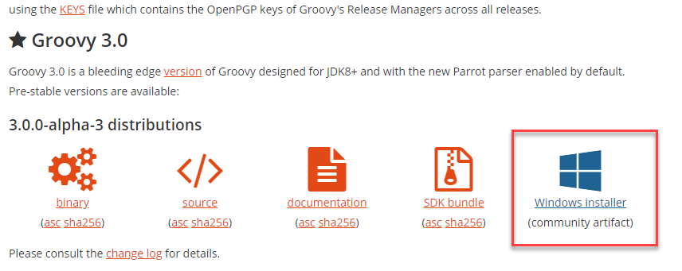
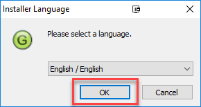
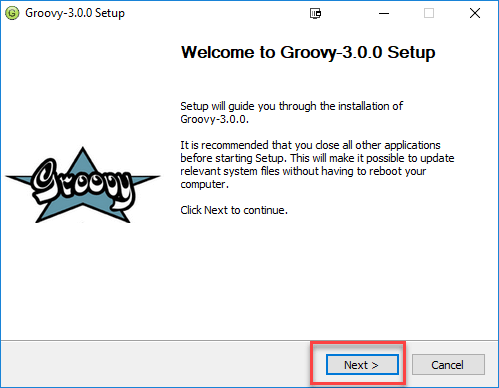
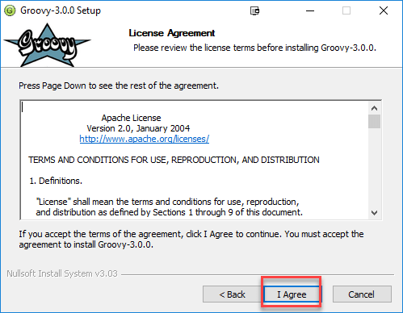
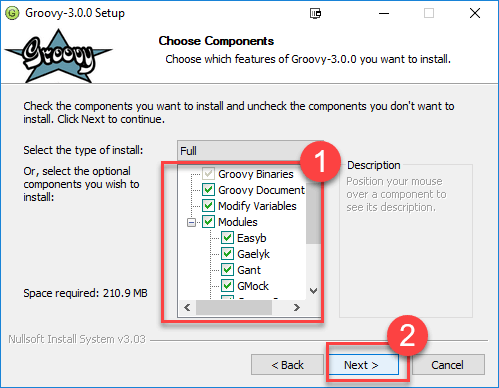
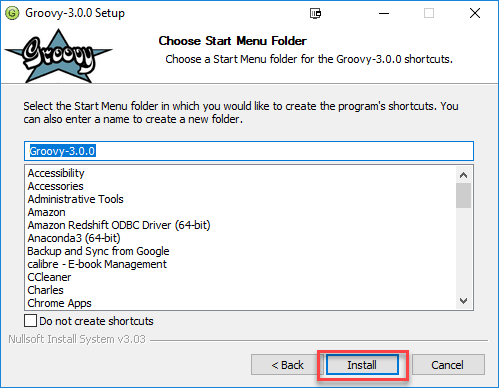
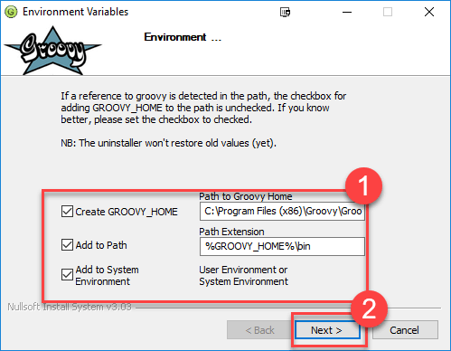
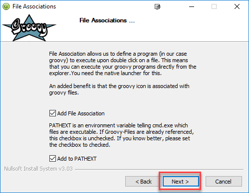
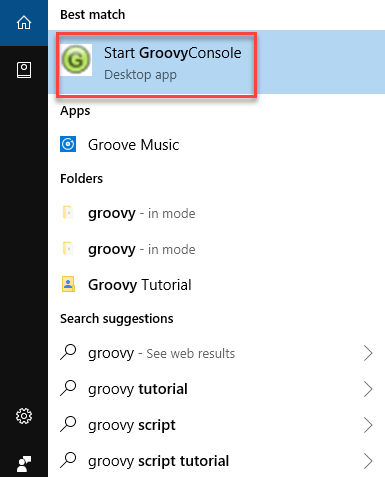

ProgLangName

- History of the language: who/when invented it, which languages influenced it, etc.
- Why was it invented
- When/why shall we use it
- How to setup an environment to use it in different platforms
- Example codes
- Things that are specific to this language?

## HISTORY OF THE LANGUAGE

James Strachan first talked about the development of Groovy on his blog in August 2003. In March 2004, Groovy was submitted to the JCP as JSR 241 and accepted by ballot. Several versions were released between 2004 and 2006. After the Java Community Process (JCP) standardization effort began, the version numbering changed, and a version called "1.0" was released on January 2, 2007. After various betas and release candidates numbered 1.1, on December 7, 2007, Groovy 1.1 Final was released and immediately renumbered as Groovy 1.5 to reflect the many changes made.

In 2007, Groovy won the first prize at JAX 2007 innovation award. In 2008, Grails, a Groovy web framework, won the second prize at JAX 2008 innovation award.

In November 2008, SpringSource acquired the Groovy and Grails company (G2One). In August 2009 VMware acquired SpringSource.

In April 2012, after eight years of inactivity, the Spec Lead changed the status of JSR 241 to dormant.

Strachan had left the project silently a year before the Groovy 1.0 release in 2007. In Oct 2016, Strachan stated "I still love groovy (jenkins pipelines are so groovy!), java, go, typescript and kotlin".

On July 2, 2012, Groovy 2.0 was released, which, among other new features, added static compiling and static type checking.

When the Pivotal Software joint venture was spun-off by EMC Corporation (EMC) and VMware in April 2013, Groovy and Grails formed part of its product portfolio. Pivotal ceased sponsoring Groovy and Grails from April 2015. That same month, Groovy changed its governance structure from a Codehaus repository to a Project Management Committee (PMC) in the Apache Software Foundation via its incubator. Groovy graduated from Apache's incubator and became a top-level project in November 2015.

### TO CLARIFY:

- 2003: Developed by Bob McWhirter & James Strachan
- 2004: Commissioned into JSR 241 but it was abandoned
- 2005: Brought back by Jeremy Rayner & Guillaume Laforge
- 2007: Groovy version 1.0
- 2012: Groovy version 2
- 2014: Groovy version 2.3 (official support given for JDK 8)
- 2015: Groovy became a project at the Apache Software Foundation

Influenced by : Java, Python, Ruby, Smalltalk
Influenced : Kotlin

### Features of Groovy

- List, map, range, regular expression literals
- Multimethod and metaprogramming
- Groovy classes and scripts are usually stored in .groovy files
- Scripts contain Groovy statements without any class declaration.
- Scripts can also contain method definitions outside of class definitions.
- It can be compiled and fully integrated with traditional Java application.
- Language level support for maps, lists, regular expressions
- Supports closures, dynamic typing, metaobject protocol
- Support for static and dynamic typing & operator overloading
- Literal declaration for lists (arrays), maps, ranges, and regular expressions

Most valid Java files are also valid Groovy files. Although the two languages are similar, Groovy code can be more compact, because it does not need all the elements that Java needs. This makes it possible for Java programmers to learn Groovy gradually by starting with familiar Java syntax before acquiring more Groovy programming idioms.

Groovy features not available in Java include both static and dynamic typing (with the keyword def), operator overloading, native syntax for lists and associative arrays (maps), native support for regular expressions, polymorphic iteration, string interpolation, added helper methods, and the safe navigation operator ?. to check automatically for null pointers (for example, variable?.method(), or variable?.field).

Since version 2 Groovy also supports modularity (being able to ship only the needed jars according to the project needs, thus reducing the size of Groovy's library), type checking, static compiling, Project Coin syntax enhancements, multicatch blocks and ongoing performance enhancements using the invokedynamic instruction introduced in Java 7.

Groovy provides native support for various markup languages such as XML and HTML, accomplished via an inline Document Object Model (DOM) syntax. This feature enables the definition and manipulation of many types of heterogeneous data assets with a uniform and concise syntax and programming methodology.

Unlike Java, a Groovy source code file can be executed as an (uncompiled) script, if it contains code outside any class definition, if it is a class with a main method, or if it is a Runnable or GroovyTestCase. A Groovy script is fully parsed, compiled, and generated before executing (similar to Python and Ruby). This occurs under the hood, and the compiled version is not saved as an artifact of the process.

## WHY WE SHOULD USE GROOVY ?

Here, are major reasons why you should use Groovy-

-  Groovy is an agile and dynamic language
-  Seamlessly integration with all existing Java objects and libraries
-  Feels easy and natural to Java developers
-  More concise and meaningful code compares to Java
-  You can use it as much or as little as you like with Java apps

Groovy is a pretty interesting programming language for Java developers, as it has become a perfect complement for this general purpose syntax. As a matter of fact, Groovy introduces interesting features to get where Java cannot. 

Apache Groovy is an object-oriented dynamic programming language for Java virtual machine (JVM). What is it usually used for? Groovy is a Java enhancer because it provides greater flexibility and even introduces special features to applications (those that have already been developed can be improved or they can be made from scratch). Groovy is a Java-like syntax, but with the ease of more moldable languages like Python and Ruby. Groovy has several interesting features:

-  Support for static and dynamic typing: statically typed languages are those in which type checking is done at the compiling stage and not during execution. Java is a general purpose statically typed language. Dynamic typing syntaxes such as Groovy are those in which the check is performed during execution. Python is another example. Groovy allows developers to introduce this typing within Java.

- Concise, brief, direct syntax: this allows developers that use Groovy to develop projects faster and easier.   

- Relatively short learning curve: this is a relatively simple language like Python or Ruby. It is easy for developers to learn. 

- Support for unit testing: Groovy is a testing-oriented development language. In fact, it is a syntax that provides support for running tests in integrated development environments (IDEs), Ant or Maven, which are all application programming tools in Java.

- Native support for regular expressions: the Groovy syntax for creating regular expressions is really simple. This programming language has three operators for regular expressions:

-       The operator regex =~.

-       The operator match ==~.

-       The pattern operator ~String.

- Native syntax for lists and associative arrays: in programming, arrays are usually assigned to variables. These variables are often associated to data. Developers sometimes associate that information through various elements of the array through a common thread called index. That way of structuring information with programming is called associative array.

- Native support for markup languages like XML and HTML.

- Support for domain specific languages: a domain specific language is a programming language or a specification dedicated to solving specific problems, through a specific technique. A general purpose syntax such as Java, C or C++ is the opposite. Somehow it provides general structure to solve global situations. 

 How to setup an environment to use it in different platforms

## Install Groovy
### 1. Download
In this download area, you will be able to download the distribution (binary and source), the Windows installer and the documentation for Groovy.

For a quick and effortless start on Mac OSX, Linux or Cygwin, you can use SDKMAN! (The Software Development Kit Manager) to download and configure any Groovy version of your choice. Basic instructions can be found below.

#### 1.1. Stable
Download zip: Binary Release | Source Release

Download documentation: JavaDoc and zipped online documentation

Combined binary / source / documentation bundle: Distribution bundle

You can learn more about this version in the release notes or in the changelog.

If you plan on using invokedynamic support, read those notes.

#### 1.2. Snapshots
For those who want to test the very latest versions of Groovy and live on the bleeding edge, you can use our snapshot builds. As soon as a build succeeds on our continuous integration server a snapshot is deployed to Artifactory’s OSS snapshot repository.

#### 1.3. Prerequisites
Groovy 2.5 requires Java 6+ with full support up to Java 8. There are currently some known issues for some aspects when using Java 9 snapshots. The groovy-nio module requires Java 7+. Using Groovy’s invokeDynamic features require Java 7+ but we recommend Java 8.

The Groovy CI server is also useful to look at to confirm supported Java versions for different Groovy releases. The test suite (getting close to 10000 tests) runs for the currently supported streams of Groovy across all the main versions of Java each stream supports.

### 2. Maven Repository
If you wish to embed Groovy in your application, you may just prefer to point to your favourite maven repositories or the JCenter maven repository.

#### 2.1. Stable Release
Gradle	Maven	Explanation
'org.codehaus.groovy:groovy:2.5.9'

<groupId>org.codehaus.groovy</groupId> <artifactId>groovy</artifactId> <version>2.5.9</version>

Just the core of groovy without the modules (see below).

'org.codehaus.groovy:groovy-$module:2.5.9'

<groupId>org.codehaus.groovy</groupId> <artifactId>groovy-$module</artifactId> <version>2.5.9</version>

"$module" stands for the different optional groovy modules "ant", "bsf", "console", "docgenerator", "groovydoc", "groovysh", "jmx", "json", "jsr223", "servlet", "sql", "swing", "test", "testng" and "xml". Example: <artifactId>groovy-sql</artifactId>

'org.codehaus.groovy:groovy-all:2.5.9'

<groupId>org.codehaus.groovy</groupId> <artifactId>groovy-all</artifactId> <version>2.5.9</version>

The core plus all the modules. Optional dependencies are marked as optional. You may need to include some of the optional dependencies to use some features of Groovy, e.g. AntBuilder, GroovyMBeans, etc.

To use the InvokeDynamic version of the jars just append ':indy' for Gradle or <classifier>indy</classifier> for Maven.

### 3. SDKMAN! (The Software Development Kit Manager)
This tool makes installing Groovy on any Bash platform (Mac OSX, Linux, Cygwin, Solaris or FreeBSD) very easy.

Simply open a new terminal and enter:

$ curl -s get.sdkman.io | bash
Follow the instructions on-screen to complete installation.

Open a new terminal or type the command:

$ source "$HOME/.sdkman/bin/sdkman-init.sh"
Then install the latest stable Groovy:

$ sdk install groovy
After installation is complete and you’ve made it your default version, test it with:

$ groovy -version
That’s all there is to it!

### 4. Other ways to get Groovy
#### 4.1. Installation on Mac OS X
##### 4.1.1. MacPorts
If you’re on MacOS and have MacPorts installed, you can run:

sudo port install groovy
##### 4.1.2. Homebrew
If you’re on MacOS and have Homebrew installed, you can run:

brew install groovy
##### 4.2. Installation on Windows
If you’re on Windows, you can also use the NSIS Windows installer.

#### 4.3. Other Distributions
You may download other distributions of Groovy from this site.

#### 4.4. Source Code
If you prefer to live on the bleeding edge, you can also grab the source code from GitHub.

#### 4.5. IDE plugin
If you are an IDE user, you can just grab the latest IDE plugin and follow the plugin installation instructions.

### 5. Install Binary
These instructions describe how to install a binary distribution of Groovy.

First, Download a binary distribution of Groovy and unpack it into some file on your local file system.

Set your GROOVY_HOME environment variable to the directory you unpacked the distribution.

Add GROOVY_HOME/bin to your PATH environment variable.

Set your JAVA_HOME environment variable to point to your JDK. On OS X this is /Library/Java/Home, on other unixes its often /usr/java etc. If you’ve already installed tools like Ant or Maven you’ve probably already done this step.

You should now have Groovy installed properly. You can test this by typing the following in a command shell:

groovysh
Which should create an interactive groovy shell where you can type Groovy statements. Or to run the Swing interactive console type:

groovyConsole
To run a specific Groovy script type:

groovy SomeScript

### Here Is The Instructions For Installing Groovy

- Step 1) Ensure you have Java installed. https://www.guru99.com/install-java.html

- Step 2) Go to http://groovy-lang.org/download.html and click installer.

Note: You can also install Groovy using the Zip file or as an Eclipse IDE. In this tutorial, we will stick to Windows Installer

- Step 3) Launch the downloaded installer. Select language and click OK.

- Step 4) Launch. In welcome screen, click NEXT

- Step 5) Agree with the license terms

- Step 6) Select components you want to install and click next

- Step 7) Select Installation Directory and click Next

- Step 8) Choose Start Menu Folder and Click Next

- Step 9) Once install is done, let the paths default and click next

- Step 10) Click Next.

- Step 11) In start Menu search for Groovy Console

